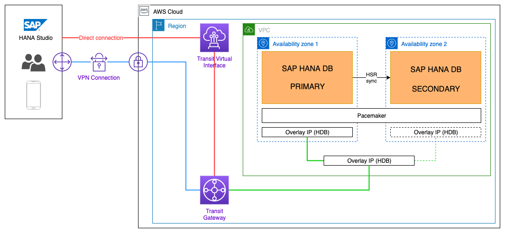
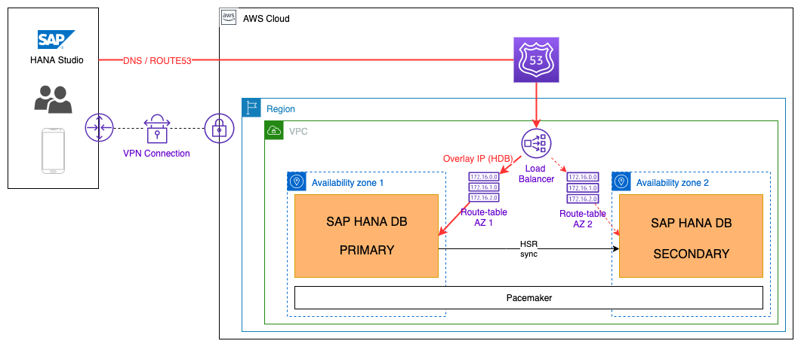

# Platform Specific Architecture for AWS (Amazon Web Services)

Description

<!-- TOC -->

- [Platform Specific Architecture for AWS (Amazon Web Services)](#platform-specific-architecture-for-aws-amazon-web-services)
  - [AWS: Overall Architecture](#aws-overall-architecture)
  - [AWS: Basic Architecture](#aws-basic-architecture)
    - [AWS: Storage Configurations](#aws-storage-configurations)
  - [AWS: Virtual Hostname/IP](#aws-virtual-hostnameip)
  - [AWS: High Availability](#aws-high-availability)
    - [Supported HANA HA options on AWS](#supported-hana-ha-options-on-aws)
      - [HANA Service Auto-Restart](#hana-service-auto-restart)
      - [Host Auto-Failover](#host-auto-failover)
      - [HANA System Replication](#hana-system-replication)
      - [HANA Backup/Restore](#hana-backuprestore)
      - [Storage Replication](#storage-replication)
    - [SAP HANA High Availability cluster on AWS](#sap-hana-high-availability-cluster-on-aws)
      - [Global Infrastructure](#global-infrastructure)
    - [AWS Specifications](#aws-specifications)
      - [Cluster floating (virtual) IP](#cluster-floating-virtual-ip)
      - [STONITH fencing](#stonith-fencing)
  - [AWS: Disaster Recovery](#aws-disaster-recovery)
  - [AWS: Data Tiering Options](#aws-data-tiering-options)
  - [AWS: XSA](#aws-xsa)

<!-- /TOC -->

## AWS: Overall Architecture

- some general text
  - some basic links to AWS reference architectures and documentation

## AWS: Basic Architecture

Link to generic content: [Module: Basic Architecture](pages/generic_architecture/module_basic_architecture.md#module-basic-architecture)

- supported instance types
- description of single node implementation (storage) + picture
- description of scale-out implementations (storage) + picture
- mention that each AZ is its own subnet
- links to AWS documentation

### AWS: Storage Configurations

- visualization of storage for AWS

## AWS: Virtual Hostname/IP

Link to generic content: [Module: Virtual Hostname/IP](pages/generic_architecture/module_virtual_hostname.md#module-virtual-hostnameip)

- how to implement virtual IP - maybe additional elastic network interface?
- reference to Instance Move and how to execute AWS specific steps (move elastic network interface?)

## AWS: High Availability

Link to generic content: [Module: High Availability](pages/generic_architecture/module_high_availability.md#module-high-availability)

### Supported HANA HA options on AWS

#### HANA Service Auto-Restart
No restrictions on AWS, the [solution](https://help.sap.com/viewer/6b94445c94ae495c83a19646e7c3fd56/2.0.02/en-US/cf10efba8bea4e81b1dc1907ecc652d3.html) works the same way as on any other platform.

#### Host Auto-Failover
[SAP solution](https://help.sap.com/viewer/6b94445c94ae495c83a19646e7c3fd56/2.0.02/en-US/ae60cab98173431c97e8724856641207.html) with stand-by mode is fully supported on AWS. As an alternative, AWS recommends to use their native [AWS automatic recovery](http://docs.aws.amazon.com/AWSEC2/latest/UserGuide/ec2-instance-recover.html) feature what provides a standby hardware without incurring the additional cost for a typical standby node.  
_**Note:** HANA Service Auto-Restart should be set to start up automatically after a system restart to ensure a fully automated recovery._ 

#### HANA System Replication
[HANA System Replication](https://help.sap.com/viewer/6b94445c94ae495c83a19646e7c3fd56/2.0.02/en-US/b74e16a9e09541749a745f41246a065e.html) is supported on AWS. It is recommended to use this solution in combination with AWS Availability Zones and Pacemaker cluster to ensure fully automated failover which helps to protects your SAP HANA systems, even from potential failures on data center level.  

#### HANA Backup/Restore
No restrictions to common solutions ([AWS descripion](https://aws.amazon.com/backup-restore/use-cases/#Database_Backup)). Additionally AWS provides an option to use [Amazon S3 object storage](https://docs.aws.amazon.com/AWSEC2/latest/UserGuide/AmazonS3.html) to copy your backup files there or to use [Amazon EBS snapshots](https://docs.aws.amazon.com/AWSEC2/latest/UserGuide/EBSSnapshots.html). 

#### Storage Replication
Storage level based replication is currently not supported on AWS.
  

### SAP HANA High Availability cluster on AWS
SAP HANA System Replication in combination with Pacemaker cluster and AWS Availability zones help to achieve very low RTO and zero RPO together with high level resiliency against HW failures (server and data center level).

Configuration Guides for:
* [SUSE Linux Enterprise Server (SLES) for SAP Application](https://documentation.suse.com/sbp/all/html/SLES4SAP-hana-sr-guide-PerfOpt-12_AWS/index.html)
* [RedHat Enterprise Linux (RHEL)](https://access.redhat.com/articles/3569621)

#### Global Infrastructure
[Global Infrastructure overview](https://aws.amazon.com/about-aws/global-infrastructure/)  
[Regions](https://aws.amazon.com/about-aws/global-infrastructure/regions_az/?p=ngi&loc=2)  
[Availability Zones](https://aws.amazon.com/about-aws/global-infrastructure/regions_az/?p=ngi&loc=2)  

All information above can be also found on [AWS infrastructure map](https://www.infrastructure.aws/). 

**Note:** Latency between Availability Zones (AZ) can differ. It is recommended to measure latency between different AZs via SAP niping in order to determine optimal pair of AZs for HA cluster.
  

### AWS Specifications
#### Cluster floating (virtual) IP
Standard Pacemaker floating IP address solution can not be used as cluster EC2 instances are located within the same Virtual Private Network (VPC) BUT in 2 different LAN layer 2 segments (Availability Zones). AWS provides solution called "[Overlay IP](https://docs.aws.amazon.com/sap/latest/sap-hana/sap-ha-overlay-ip.html)" (OIP) which routes all traffic for an IP address to correct destination EC2 instance. Cluster resource agent "aws-vpc-move-ip" creates/modifies a routing entry in routing table shared between cluster EC2 instances via AWS API in order to direct the traffic to correct instance.

Following two options can be used to configure the Overlay IP:
1) [Overlay IP Routing using AWS Transit Gateway](https://docs.aws.amazon.com/sap/latest/sap-hana/sap-oip-overlay-ip-routing-using-aws-transit-gateway.html)

2) [Overlay IP Routing with Network Load Balancer](https://docs.aws.amazon.com/sap/latest/sap-hana/sap-oip-overlay-ip-routing-with-network-load-balancer.html)

 

**Be aware:**
* The cluster floating IP address has to be outside of Classless Inter-Domain Routing (CIDR) block of the VPC,
* Both EC2 instances of the cluster are sharing the same routing table.  

**Notes:**
* HANA HA cluster solution within local (one) AZ can use EC2 Elastic IP and standard IP failover mechanism.  
* Additional OIPs can be added based on various solution's requirements (e.g. [HSR Active/Active Read-Enabled Option](https://help.sap.com/viewer/de855a01ee2248dfb139088793f8802a/2.0.04/en-US/2d53c16348314856b6fc92bb0f80aa30.html), Tenant Virtual IP ).  
* The agent is supported on SUSE as well as on RHEL.  

#### STONITH fencing
STONITH fencing agent "[fence_ec2_sap](https://github.com/ClusterLabs/cluster-glue/blob/master/lib/plugins/stonith/external/ec2)" for Pacemaker cluster on AWS (EC2) is using [EC2 API](https://docs.aws.amazon.com/AWSEC2/latest/APIReference/index.html) to reboot (default option, slower as it waits till reboot is completed) or to hard-shuttoff (option recommended by SUSE) a cluster node. 

**Be aware:**
* STONITH EC2 Policy has to be set in order to provide privilege to start and stop other nodes in the cluster, 
* AWS API requires external IP access (http proxy setting to be adjusted), 
* EC2 instance tags have to be properly set as they are used by the agent to identify cluster nodes.

**Note:** The agent is supported on SUSE as well as on RHEL.

## AWS: Disaster Recovery

Link to generic content: [Module: Disaster Recovery](pages/generic_architecture/module_disaster_recovery.md#module-disaster-recovery)

## AWS: Data Tiering Options

Link to generic content: [Module: Data Tiering Options](pages/generic_architecture/module_data_tiering.md#module-data-tiering-options)

- what is supported what is not (matrix)
- links to AWS documentation
- modified pictures of storage setup (if required)

## AWS: XSA

Link to generic content: [Module: SAP XSA](pages/generic_architecture/module_xsa.md#module-sap-xsa)

- I think there is nothing infrastructure specific

 MCS10SMSAP-85
	
Support of larger vHANA up to 6TB on Cascade Lake in MgdApps SAP on IBM Cloud
	
23p
	
SAP HANA RR: Regression test for vHANA HA and DR (2p)
	1
MCS10SMSAP-86
	
Support of all certified Cascade Lake pHANA sizes
	
3p
	
SAP HANA RR: Regression test for pHANA HA and DR (2p)
	1
MCSMMSAP-163
	
Mgd Apps SAP on AIX / IBM Power Systems Virtual Servers on IBM Cloud - Phase 2b (Additional items support + EU/APJ deployments)
	
21p
	
SAP HANA RR: Support integration with HANA on Intel (3p)
	1
MCSMMSAP-161
	
Support of HANA on Power (HA) in MgdApps SAP
	
13p
	
SAP HANA RR 1.: HA for HANA on Power without fencing (5p)
SAP HANA RR 2.: HANA on Power Fencing (8p)
	2
MCSMMSAP-160
	
Support of HANA on Power (DR) in MgdApps SAP
	
3p
	
SAP HANA RR: DR for HANA on Power (3p)
	1
MCSMMSAP-122
	
Automated Customer - Level Failover/Failback for Unplanned Extended Outage - Implementation Phase (incl. non-HANA and automation) 